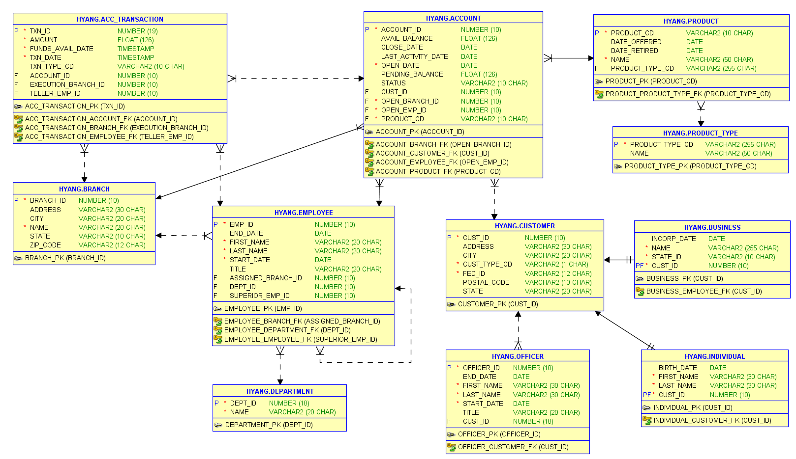
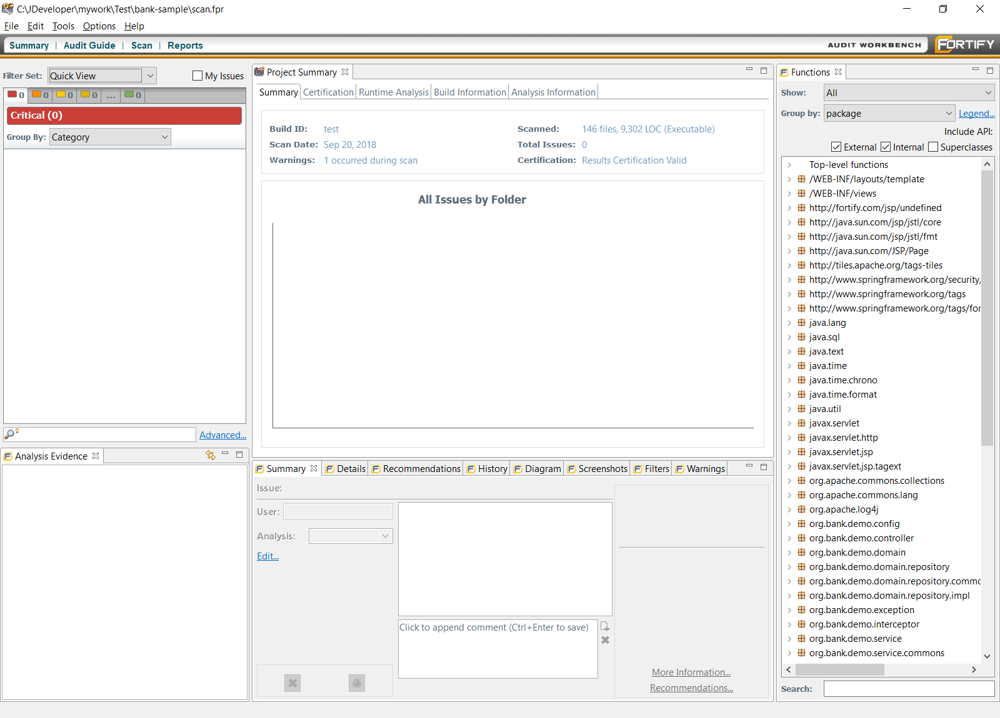

# Sample Spring Application Code


## Sample database schema


[SQL Script file](db/oracle-hr-example.sql)

## Source directory structure 

complete Spring Framework Application generated from the DB schema in several minutes

```

+---main
|   +---java
|   |   \---org
|   |       \---bank
|   |           \---demo
|   |               +---config
|   |               +---controller
|   |               +---domain
|   |               |   \---repository
|   |               |       +---commons
|   |               |       \---impl
|   |               +---exception
|   |               +---interceptor
|   |               +---service
|   |               |   \---commons
|   |               \---util
|   +---resources
|   \---webapp
|       +---resources
|       |   +---css
|       |   +---fonts
|       |   +---imgs
|       |   \---js
|       |       \---vendor
|       \---WEB-INF
|           +---layouts
|           |   +---definitions
|           |   \---template
|           \---views
\---test
    +---java
    \---resources

```
	
## Met the security scan requirements (without code changes)

HP Fortify Scan - 0 ciritical/ 0 high / 0 medium issues with default security cateogry



[HP Fortify Scan - CWESANSTop25 ](scan_CWESANSTop25.pdf)

[HP Fortify Scan - DeveloperWorkbook ](scan_DeveloperWorkbook.pdf)

